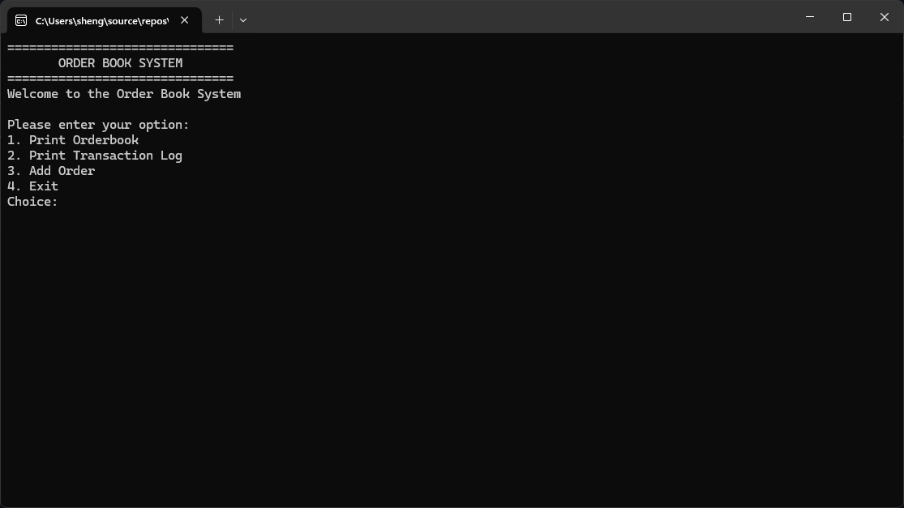
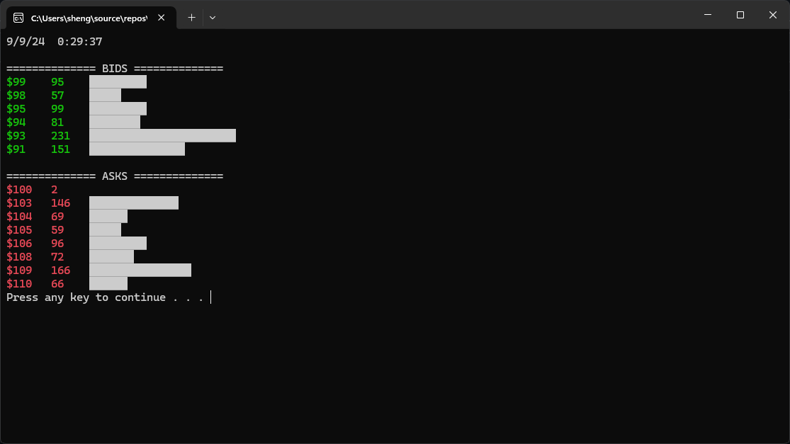
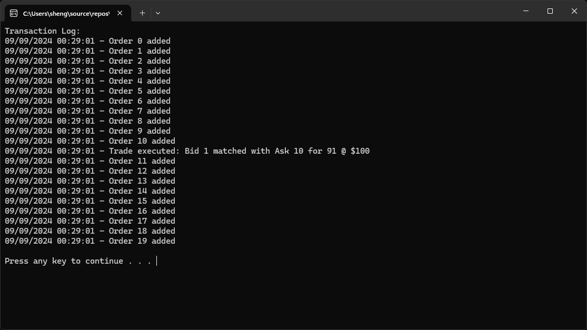
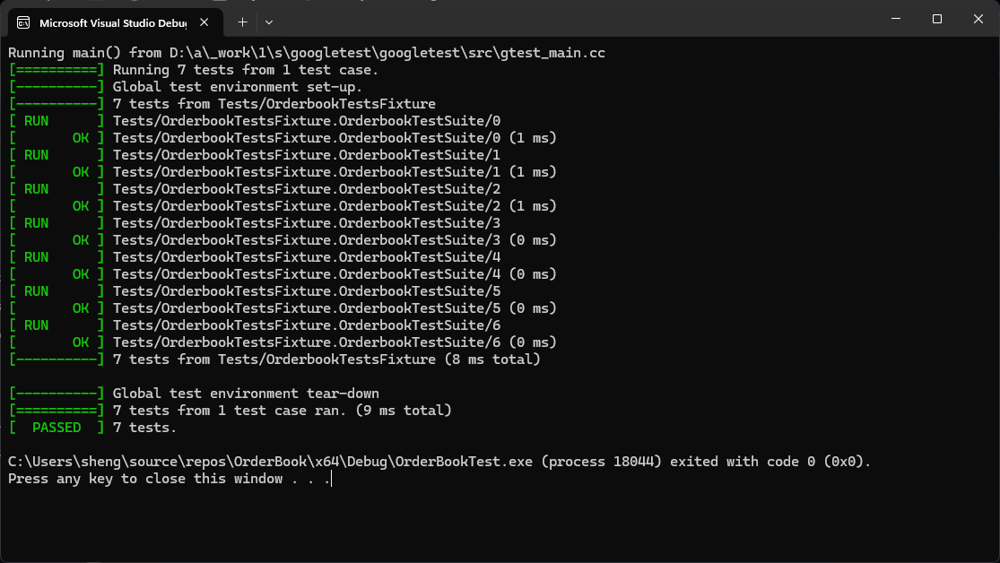

Order Book System Documentation
===============================

Overview
--------

The Order Book System is a console-based application that simulates an order book commonly used in financial markets for managing buy and sell orders. It allows users to add, modify, and cancel orders while keeping track of the order status and transaction log. The system processes up to 5 kind of orders(Market, Good For Day, Fill Or Kill, Fill And Kill & Good Till Cancel) and executes trades when possible based on price matching.

Core Components
---------------

### 1\. `Order`

The `Order` class represents a single order in the system. It encapsulates attributes like:

-   `OrderType`: The type of order (Market, Fill or Kill, Good Till Cancel, etc.)
-   `OrderId`: A unique identifier for each order
-   `Side`: Whether it's a Buy or Sell order
-   `Price`: The price at which the order is placed (if applicable)
-   `InitialQuantity`: The initial quantity requested
-   `RemainingQuantity`: The amount still unfilled

Key methods:

-   `Fill(Quantity)`: Reduces the remaining quantity when the order is filled.
-   `IsFilled()`: Checks if the order has been fully filled.
-   `ToGoodTillCancel(Price)`: Converts a market order into a Good Till Cancel order.

### 2\. `Orderbook`

The `Orderbook` class is the core of the system, maintaining the state of all current orders and handling operations like adding, modifying, canceling, and matching orders.

Key features:

-   **Order Matching**: The system matches buy and sell orders based on price. The best bid (highest buy price) is matched with the best ask (lowest sell price).
-   **Concurrency Handling**: Mutexes and condition variables ensure thread safety when accessing the order book in a multi-threaded environment.
-   **Order Types**: Supports various order types, including `Market`, `Good Till Cancel`, `Fill and Kill`,  `Fill or Kill` and `Good for Day`.
-   **Transaction Logging**: Every action taken on the order book (e.g., adding, modifying, or canceling orders) is logged for tracking purposes.

Key methods:

-   `AddOrder(OrderPointer)`: Adds a new order to the order book.
-   `CancelOrder(OrderId)`: Cancels an order based on the given `OrderId`.
-   `MatchOrders()`: Matches buy and sell orders and executes trades when possible.
-   `PrepopulateOrderBook()`: Prepopulates the order book with random orders for demonstration purposes.

### 3\. `OrderModify`

Handles modification of existing orders by allowing changes to the side (Buy/Sell), price, and quantity.

Key methods:

-   `ToOrderPointer(OrderType)`: Converts the modification request into a new `Order` object.

### 4\. `OrderbookLevelInfos`

Provides a snapshot of the current state of the order book, showing the bid and ask prices along with their respective quantities.

### 5\. `TransactionLog`

Keeps a history of all actions taken on the order book, including orders added, modified, canceled, and trades executed.

Key methods:

-   `AddTransaction(std::string)`: Adds a new transaction to the log.
-   `GetFormattedLog()`: Retrieves the formatted log as a string for display.

### 6\. `PruneGoodForDayOrders` (Thread Usage)

The `PruneGoodForDayOrders` function is responsible for managing and automatically canceling `GoodForDay` orders when the trading day ends. It runs in a **background thread**, ensuring that once the market closes, all `GoodForDay` orders are removed without user intervention.

#### Key Features:

-   **Thread-based Execution**: A dedicated thread waits until the market closing time (4 PM) and cancels all `GoodForDay` orders.
-   **Concurrency Safety**: Uses mutexes to lock the order book while removing expired orders, preventing data corruption and ensuring thread safety.
-   **Automated Order Management**: The function runs independently in the background, ensuring that `GoodForDay` orders are pruned daily, maintaining accuracy and efficiency.

This demonstrates the use of threads in the system for background tasks that require scheduled, time-based actions, such as managing the expiration of orders.

Order Types
-----------

-   **Market**: An order to buy or sell immediately at the current market price.
-   **Good Till Cancel**: Remains active until fully filled or explicitly canceled.
-   **Fill or Kill**: Must be fully filled immediately or canceled.
-   **Fill and Kill**: Partially fills whatever quantity is available immediately and cancels the rest.
-   **Good For Day**: Similar to Good Till Cancel but with a time constraint; the order is removed at the end of the day.

Concurrency and Thread Safety
-----------------------------

-   The `Orderbook` class is designed to be thread-safe, using mutexes (`std::mutex`) to protect shared data structures such as orders and price levels. A separate thread is dedicated to handling the expiration of `GoodForDay` orders at the end of the trading day.

Running the Order Book System
-----------------------------

- Clone the repo: `git@github.com:CLinnSheng/OrderBook.git`
- `cd OrderBook`
  
You have two options for running the Order Book System:

### 1\. **User Interaction Mode**

In this mode, the system allows user input for adding, modifying, or canceling orders. It also prepopulates the order book with some initial buy and sell orders for easier testing and visualization.

To run in **User Interaction Mode**:<br>
1. Compile: `g++ *.cpp -o main`
2. Run: `./main`

You will be prompted to:

-   Print the order book.
-   Print the transaction log.
-   Add, modify, or cancel orders.
-   Exit

### 2\. **Test Mode using GoogleTest**

This mode runs predefined test cases using the GoogleTest framework to ensure the order book's functionality, such as order matching, cancellation, and thread safety, works as expected.

To run in **Test Mode**:

Ensure you have [GoogleTest](https://github.com/google/googletest) installed.<br>

Comment the `prepoulateOrderBook()` function in the constructor of Orderbook, `Orderbook()`

See [line 329](https://github.com/CLinnSheng/OrderBook/blob/main/OrderBook.cpp?plain=1#L329)

```
Orderbook::Orderbook() : ordersPruneThread_{ [this] { PruneGoodForDayOrders(); } }
{
	// When an orderbook is created, a new thread is also created.
	// The purpose of this thread is to wait till the end of day, for every order that is GoodForDay
	// All the order will be cancel
	// prepopulateOrderBook();
}
```

1. Change directory: cd ./OrderBookTest/
2. Compile: g++ *.cpp -o test
3. Run tests: ./test


This will automatically run all test cases and output the results, allowing you to validate the system's correctness.

Screenshots
-----------------------------




